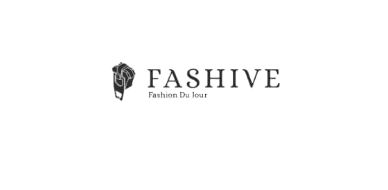

<p align="center">
  <a href="https://fashive.co">
    
  </a>
  <h1 align="center">fashive.co</h1>
</p>

---

### 🛍️ Welcome to Fashive.co!

This is the front-end repository for fashive.co, a dynamic e-commerce web application. Built with modern web technologies, this project provides a clean and responsive user interface for an online catalog.

## ✨ Features

- **Dashboard**: A central hub for managing your e-commerce data.
- **Authentication**: Secure user login and registration system.
- **Transaction Management**: A component dedicated to managing and viewing transaction history.
- **Data Tables**: Displays product information, such as brands and variants, in an organized, searchable format.
- **User Interface**: A consistent and customizable UI with a sidebar navigation system.

## 🛠️ Technology Stack

- **Framework**: Vue.js
- **Build Tool**: Vite
- **State Management**: Pinia
- **Routing**: Vue Router
- **Styling**: Tailwind CSS

## 🚀 Installation

To set up this project locally, follow these simple steps.

1.  **Clone the repository** 🌐:
    ```bash
    git clone [https://github.com/malvin1108/fashive_web.git](https://github.com/malvin1108/fashive_web.git)
    cd fashive_web
    ```

2.  **Install dependencies** 📦:
    ```bash
    npm install
    ```

3.  **Run the development server** ▶️:
    ```bash
    npm run dev
    ```
    The application will now be running on `http://localhost:5173`.

4.  **Build for production** 🏗️:
    ```bash
    npm run build
    ```
    This command will generate the production-ready static files in the `dist` directory.
